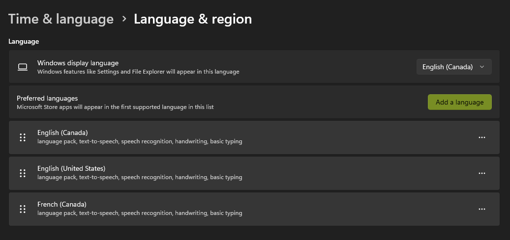
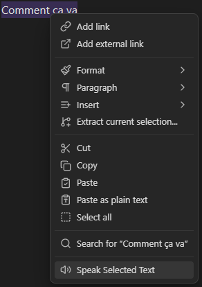
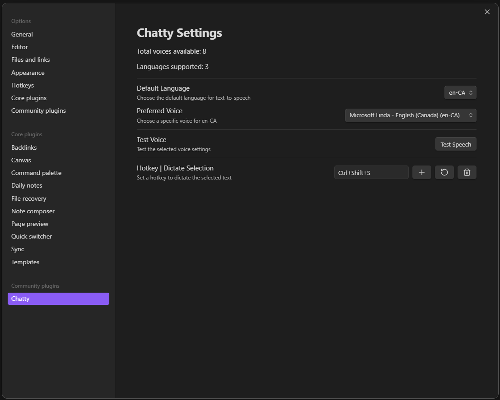

# Chatty

A simple plugin for Obsidian that allows you to listen to your notes using text-to-speech.

No external apis, just uses the browser's built-in speech synthesis capabilities and your default system voices.

> This plugin has been tested on Windows only.

## Setup

The plugin uses your system's default languages and their text-to-speech voices.
In order to add a new language, you need to install the language pack for your operating system.

For Windows, you can do this by going to Settings > Time & Language > Language, and then adding a new language.

## Features

You can either select the text in your notes, right-click, and select "Speak Selected Text".

Or you can select the text and then use the hotkey combination, the default hotkey is `Ctrl + Alt + S`.

But you can change this in the plugin settings, along with the voice and language settings.

> Beware that certain hotkey combinations may not work as they might already be used by Obsidian or by other plugins.

